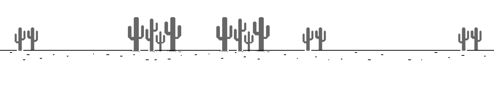
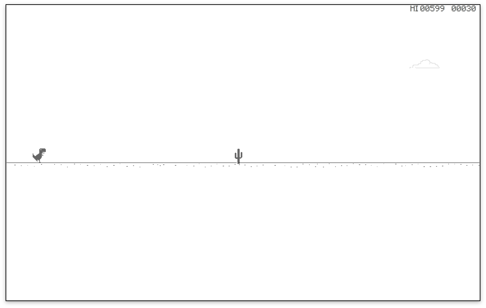
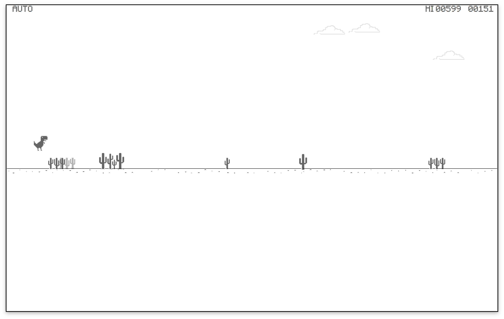
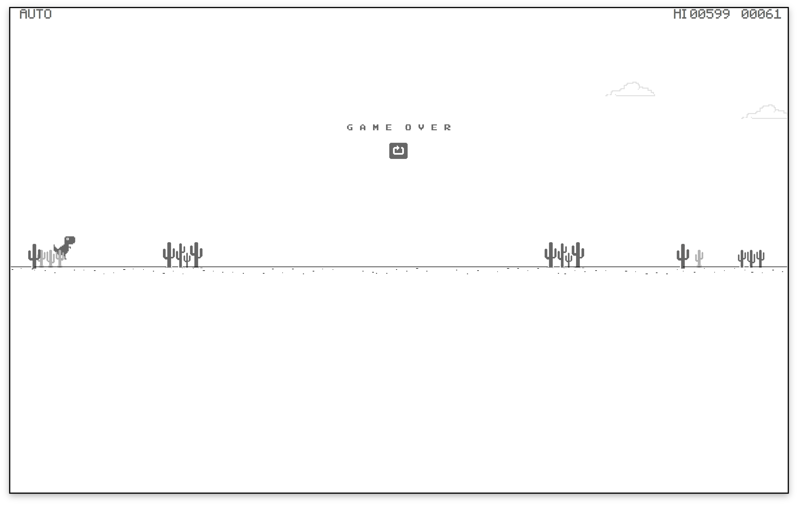

# Dino

by Dazhi

## English Version

    there is a Chinese version in the back

    后面有中文版

So this is some code I wrote just after I finished my finals.

For clarification this is my ripoff version of Chrome's easter egg Dinosaur game.

I was trying to **have some fun** when i wrote it

So uhhh I guess its not so much of a *well written* code but something one would *have fun* playing.

I wrote this in about 3 hours, I know its a bit much for a game as simple as the Dinosaur game in Chrome, but in my defense I'm a bit of a starter and I just finished my finals

also, its only written using python tkinter canvas. I know its kind of dumb, but I didn't feel like learning anything new.

So after writing the code I put in another 3 hours of playing and testing, and I feel like it is well polished, at least in the eye of me : a person that does not expert in game design.

so I guess you'll have some fun playing this somewhat absurd game.

why absurd you may ask?

Well great question chief let me explain.

## Special “Features”

1. So I guess I was **extremely tired** when I wrote the code, and I wrote some code so that after a cactus has spawned there would be one tenth or one eighth chance that there would be a slightly paler colored cactus that spawns right after it.
   

    kinda just like this, but the kind of cacti varies. I guess I tried to make the game harder? truly idk 

    I wrote half of the code in extreme sleep deprivation

    lmao

2. Also I used a random function for catus spawn, but I got kinda extreme and the map could generate viciously hard patterns, but I was just too tired to care, but don't think of it as a *bug*, think of it as a ***feature***. 

    So here you go
    
    see if you can jump over ***this***

3. yeah so five minutes after I found out that it was generating damned maps I got fustrated and started mashing my keyboard, like all gamers would.

    nah jk

    so then I found out beacuse of my bad code, you could actually activate the `jump` function multiple times if you don't release the button initally pressed

    it's a small problem and easily fixed, yet it seems like the bug was the solution to the hard maps

    So **again** don't think of it as a *bug*, think of it as a ***feature***. 

    I also have a little indicator for how high the dinosaur has gone out of screen for my pleasure
    

4. I made an `auto` mode for testing, and the secret key is `p`, the bot is stupid its just timed jumps, it was useful in early tests but not so much in this version.

    but have fun

    I would be flattered if someone would copy & paste some machine learning code in my code, but I guess thats not happening, just like my relationship with this cute girl in class

    ahh now I'm depressed again

5. I didn't want to make you install another package that installs fonts, so I guess if you're a man of culture theres a `.ttf` pack in the repo, the code works fine without it, it's just for visual pleasure.
   
6. aaaand folks thats it

## Installing and playing

    mkdir /path/to/the/code/

    pip install requirements.txt

    python Dino.py

I've only tested it on my Mac so if it doesn't work on windows and linux...

...f you then for making a bad choice of choosing systems

nah just contact me and I'll try to make it work,

Or you could do it yourself and tell me how, I'd be flattered

## some extra pictures

## 前言

首先，先说一下，这是一个满潦草的代码

我自己也是本着能用，能看就行的心理写完的

**没什么可读性**，估计**没什么可以借鉴的地方**，就当看看小恐龙跳着看个乐吧

如果不嫌弃，玩玩玩腻了可以顺便帮我改改代码hhh

大致是如此。

素材都是直接从Chrome上截图的，估计也不算侵权哈

## 说一下大概比较有特点的地方

1. 仙人掌会连着，大概就是体婴儿仙人掌
   

   后面那个颜色是浅一点的，我也不知道为啥这么设计

2. 会有诡异复杂的地形，虽然是微调难度没有调好的结果。。。

   我们姑且称之为特性。。。
   

3. 我亲切地设置了Auto模式，按`p`可以自动跳。虽然难的地方跳不过，毕竟只是为了方便测试。
4. 如果你(~~像我一样~~)是个有品位的人，可以自己安装我顺带的 `.ttf` 字体包
5. 大概就这样

## 安装

    mkdir /path/to/the/code/

    pip install requirements.txt

    python Dino.py

